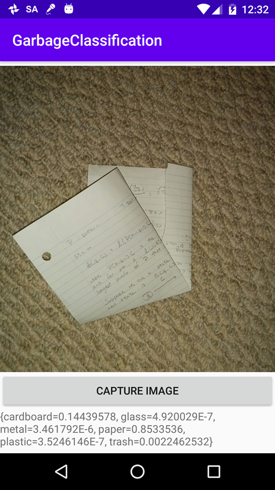
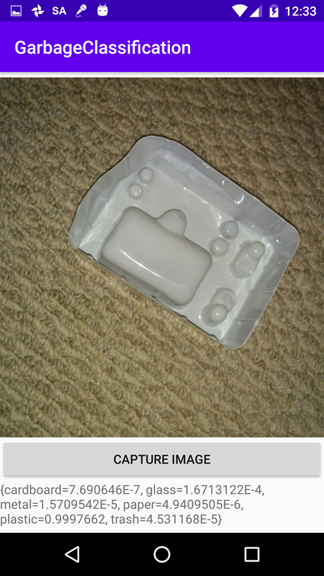

# Garbage Classification App

This is meant to be a revisiting of the [Hackathon project](https://github.com/ProjectNexus02/GarbageDetection) with a new model and application interface

## Training
- Training code can be found in this [notebook](model_training/garbage_classification.ipynb)
- Achieved about 88% accuracy on the testing dataset

## Models
- The trained model can be found [here](https://drive.google.com/file/d/1zXDqdxios0rDFndcceX997IItjR29LUS/view?usp=sharing)
- The lite version (used in the actual application) can be found [here](android_app/app/src/main/assets/models)

## Examples
A quick test using the application and the trained model yielded the following

In the first case, the model predicts the item to be of category "paper" with 85% confidence, and 
in the second case, it predicts the item to be of category "plastic" with 99.9% confidence.

In both cases, the highest probability corresponds to the true category. We note however that 
the model has been trained on images that have pretty good lighting, meaning that a good 
accuracy is only expected on relatively well-lit pictures.
